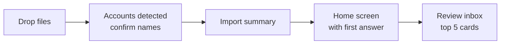
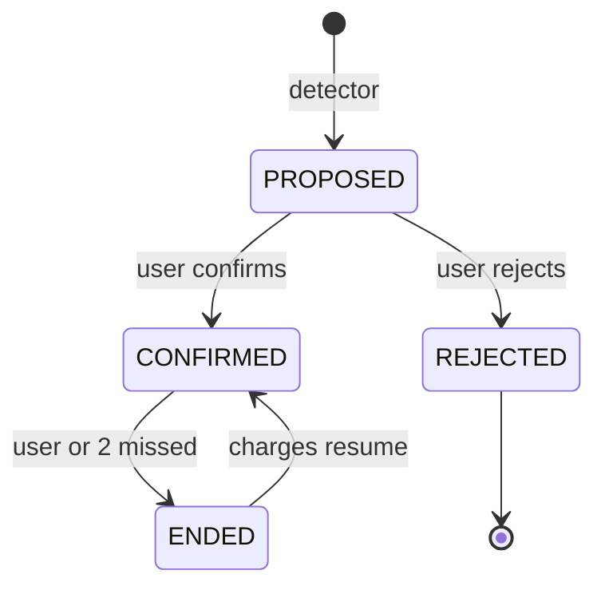

# Bank Statement Analyzer — Design

Sep 21, 2026 · @Costin Fl

## Overview

The product answers one question: **where does my money go?** Everything else — imports, deduplication, classification, recurrence detection — exists to make that answer accurate with minimal effort from the user.

Three questions the user should be able to answer within 10 seconds of opening the app:

1. How much did I spend this month, and is that more or less than usual?
2. Which 3–5 categories take most of it?
3. How much is committed every month before I spend anything — subscriptions and recurring bills — and did any of them change?

**Goals**

- **Answer first, data second:** the app opens on the answer (spend, top categories, committed monthly total), never on a transaction list.
- **Low effort:** the user uploads files and confirms a short list of suggestions; nothing requires setup before the first insight.
- **Trustworthy numbers:** idempotent import across files and accounts, own-account transfers excluded from spending, so totals match reality.
- **Categories** that are right by default and corrected in one tap, with the correction applied to the whole merchant.
- **Recurring payments** detected at daily, weekly, monthly and yearly cadence, proposed for confirmation, then tracked for price changes and missed charges.

**Non-goals for v1**

- Households, shared visibility and settlement (designed for, not built — see Household extension).
- Live bank connections (PSD2 / open banking). Import is file-based only.
- Budgets and forecasting beyond the next expected subscription charge.

**Stack assumption:** Java 21 + Spring Boot, Postgres, file storage on GCS or local disk. Upload handling can reuse the atomic multi-file pattern from file-intake.

## Home screen

The home screen shows the answer for the selected month in four stacked blocks, top to bottom in order of importance; no transaction list appears here.

| Block | Shows | Tapping it opens |
| --- | --- | --- |
| 1. Month summary | Total spent · vs. average of previous 3 months (+12%, arrow) · income · net | Transactions for the month |
| 2. Where it went | Horizontal bars of top 5 categories, sorted by amount, each with % of total and delta vs. usual; the rest folded into "Other" | Category detail |
| 3. Committed every month | Monthly-equivalent total of confirmed recurring payments (yearly ÷ 12, weekly × 4.33) · count · share of monthly spend | Recurring payments |
| 4. Needs your attention | Count badge: new subscription suggestions, price changes, uncategorized transactions | Review inbox |

**Design rules**

- One month at a time, switched by swiping or a month picker; a "last 3 months" toggle for smoothing.
- Every number is tappable and leads to the transactions that make it up — the user can always verify.
- Horizontal bars, not pie charts: easier to compare and to read labels on a phone.
- Transfers between own accounts, and income, are never counted in "spent".
- Accounts filter at the top (all accounts by default); household filter later.
- Plain-language insight line under block 2, generated from the numbers: "Restaurants are up 40% vs. your usual — 9 visits this month." At most one line, only when a delta is notable (> 25% and > 100 RON).

## Detail screens

Each detail screen answers one follow-up question from the home screen and ends at the transactions behind it.

**Categories — "what exactly is in this category?"**

- Monthly trend for the category over the last 6–12 months (bars), with the average as a line.
- Top merchants inside it, sorted by amount, with visit count: "Kaufland — 1,240 RON, 11 visits".
- Recurring payments inside it listed first, separately from variable spending.
- Recategorize a merchant from here: moving one moves all its transactions, past and future.

**Recurring payments — "what am I committed to?"**

- Sorted by monthly-equivalent cost, highest first — the question is "which ones cost me most", not "which is due next".
- Each row: name, cadence, amount, next expected date, status chip (Active, Price changed, Missed, Ended).
- Grouped: Subscriptions (streaming, software, gym) · Bills (utilities, telecom, rent, insurance) · Standing transfers (savings, own accounts — shown but excluded from the total).
- Header totals: committed per month, per year. The yearly number is the one that surprises people.
- Row actions: rename, change category, mark ended, "remind me before next charge".

**Transactions — "show me the raw data"**

- Reached from any number; arrives pre-filtered (month + category, or merchant, or subscription), with the filter visible as removable chips.
- Search by merchant or amount; filters for account, category, recurring yes/no.
- Each row shows the merchant display name, not the raw bank string; raw text on expand.
- Inline category change with the "apply to all from this merchant?" prompt.

## Review inbox

Every decision the system needs from the user goes into one queue, ordered by money impact, so a few taps fix most of the picture.

| Card type | Question on the card | Actions |
| --- | --- | --- |
| Subscription suggestion | "Spotify, 29.99 RON monthly since March — is this a subscription?" | Yes · Not recurring · Edit |
| Price change | "Netflix went from 49.99 to 59.99 RON" | Got it · Mark ended |
| Missed charge | "Gym usually charges around the 5th — nothing this month" | Cancelled · Still active |
| Uncategorized merchant | "12 transactions, 830 RON from MERCHANT X" | Pick category (applies to all) |
| Possible duplicate | "Same 120 RON at Emag, pending and posted" | Same · Different |

**Rules**

- Sort by RON affected, largest first: fixing one 830 RON merchant matters more than ten 5 RON coffees.
- One card = one merchant, never one transaction.
- Every card is skippable; skipped cards return after the next upload, not immediately.
- Swipe right = accept the suggested answer, left = reject — fast on a phone.
- The home screen shows a small "accuracy" indicator: share of this month's spend that is categorized and reviewed (e.g. 94%), so the user knows how far to trust the totals.

## First-run flow

A new user reaches a useful home screen after one upload and no setup; accounts and categories are created on the way, not before.



1. **Drop files** — drag several files at once, any bank, any overlap. No account setup screen.
2. **Accounts detected** — "Found 2 accounts: ING current ••4412, ING savings ••9031". User can rename ("Main", "Savings"). Only asked if detection fails.
3. **Import summary** — plain numbers: "412 transactions, Jan 3 – Mar 31. 18 already imported, skipped. 6 transfers between your accounts, excluded from spending." Showing skipped duplicates builds trust in idempotency.
4. **Home screen** — immediately, with whatever classification succeeded; the accuracy indicator shows how much is still uncertain.
5. **Review inbox** — offered, not forced: "5 quick questions would make this 97% accurate."

**History nudge:** with less than 3 months imported, the recurring screen says "Upload 3+ months to detect monthly payments, 12+ for yearly ones" instead of an empty list.

## Processing pipeline

Every stage is re-runnable from stored raw rows, so improving a parser or classifier never requires a re-upload.


Stages A–F run synchronously per upload inside one DB transaction; G–I run as an async job over the whole account set, because recurrence needs history beyond the uploaded file.

## Data model

Facts (raw rows, transactions) are immutable or append-only; interpretations (category, subscription link, transfer pair, later settlement) live in their own columns or tables so they can be recomputed.

| Table | Key columns | Notes |
| --- | --- | --- |
| `household` | id, name | One per user in v1; exists now so ownership never needs a migration |
| `app_user` | id, household\_id, email |  |
| `account` | id, household\_id, owner\_user\_id, iban\_hash, iban\_masked, currency, kind (CURRENT, SAVINGS, CARD), visibility (PRIVATE, HOUSEHOLD) | IBAN stored hashed + masked, never plain |
| `statement_file` | id, account\_id, sha256, format, period\_from, period\_to, uploaded\_at, status | Unique on (account\_id, sha256) → exact re-upload is a no-op |
| `raw_row` | id, statement\_file\_id, row\_no, payload jsonb | Never modified; source for reprocessing |
| `transaction` | id, household\_id, account\_id, identity\_key, booking\_date, value\_date, amount\_minor, currency, description\_raw, description\_norm, merchant\_id, category\_id, category\_source, category\_confidence, status (PENDING, POSTED), transfer\_pair\_id, subscription\_id | Unique on (account\_id, identity\_key); amounts as long minor units |
| `transaction_source` | transaction\_id, raw\_row\_id | Many raw rows → one transaction when the same record arrives in several files |
| `merchant` | id, key, display\_name, default\_category\_id | key = normalized merchant string |
| `category` | id, parent\_id, code, name | Seeded tree; user may add |
| `category_rule` | id, household\_id, priority, match\_type, pattern, category\_id | User and learned rules |
| `subscription` | id, household\_id, merchant\_id, account\_id, cadence, interval\_n, anchor\_day, amount\_kind (FIXED, VARIABLE), expected\_amount\_minor, tolerance\_pct, next\_expected\_date, state | Candidates and confirmed in one table, distinguished by state |
| `subscription_rejection` | household\_id, merchant\_id, amount\_band | Prevents re-proposing |
| `soft_match_review` | id, txn\_a, txn\_b, reason, resolution | Possible pending/posted duplicates |

## Transaction identity and idempotency

The identity key is content-derived and file-independent, with an occurrence index to separate legitimate identical transactions.

**Priority of identity sources**

1. Bank-provided reference (CAMT.053 `AcctSvcrRef` / end-to-end ID, MT940 `:61:` reference) when present and non-empty: `identity_key = "ref:" + ref`.
2. Otherwise a content key: `sha256(account_id | booking_date | amount_minor | currency | description_norm)` plus `#n`.

**Occurrence index**

Within one import, rows with the same content hash on the same booking date are sorted by (value\_date, description\_raw, row\_no) and numbered `#1`, `#2`… Re-uploading the same or an overlapping period reproduces the same numbering, because it depends only on the rows of that date, not on the file.

Edge case: a later file contains a day only partially (statement cut mid-day). Rule: only upsert occurrences up to the count seen; never delete. If a later upload shows 3 identical rows where an earlier one showed 2, `#3` is simply new.

**`description_norm` for hashing** must be stricter than for display: uppercase, strip diacritics, collapse whitespace, drop volatile tokens (auth codes, timestamps, card masks). If the normalizer changes, identity keys change — so version it (`key_v1`, `key_v2`) and never recompute keys of existing rows silently.

**Pending vs posted**

A pending card payment can reappear posted with a shifted date or a final amount (FX, tips). The hash will not match. Soft-match pass after upsert:

- same account, opposite status (PENDING / POSTED)
- |amount difference| ≤ 5% or ≤ 2 currency units
- booking dates within 5 days
- merchant key equal

A single unambiguous match auto-links (pending is marked superseded, not deleted). Several candidates go to `soft_match_review`.

## Statement parsing

Parsers are plugins keyed by bank + format; a detector picks one by sniffing the file, and the user can override it.

```java
public interface StatementParser {
    String id();                         // "ing-ro-csv-v1"
    DetectionScore detect(FileSample s); // 0..1 from header, delimiter, encoding
    ParsedStatement parse(InputStream in); // account hint + period + raw rows
}
```

- **Preferred formats:** CAMT.053 (ISO 20022 XML) and MT940 carry structured fields and references. Use them whenever a bank offers them.
- **CSV:** per-bank column mapping, locale-aware decimals (`1.234,56`), date formats, encodings (UTF-8, Windows-1250 for older Romanian exports).
- **PDF:** deferred. Table extraction is fragile; add only for a bank that offers nothing else.
- **Account detection:** from IBAN in the header when present; otherwise the user picks the account on upload.
- **Golden-file tests:** one anonymized sample per parser, checked into the repo, asserting row count, sums and identity keys.

## Internal transfer detection

Transfers between the user's own accounts are paired and excluded from spending and recurrence by default; otherwise a standing monthly transfer to savings looks like a perfect subscription.

A pair is two transactions where:

- both accounts belong to the same household
- signs are opposite and absolute amounts are equal (same currency), or within FX tolerance for cross-currency
- booking dates are within 3 business days
- optional boost: counterparty IBAN in one description matches the other account's `iban_hash`

Matching runs greedily by smallest date gap; ties go to review. A paired transaction gets `category = TRANSFER` with `category_source = SYSTEM`.

One-sided transfers (the other account isn't uploaded yet) are still recognisable via counterparty IBAN and get provisionally marked; they pair up automatically when the other statement arrives.

Recurring own-account transfers can still be shown in a separate "standing transfers" list — useful, just not a subscription.

## Merchant normalization and classification

Classify merchants, not transactions: a normalized merchant key is resolved once and cached, so new transactions from a known merchant cost nothing.

**Normalization steps** (ordered, each a unit-tested function)

1. Uppercase, strip diacritics, collapse whitespace.
2. Remove channel prefixes: `POS`, `CUMPARARE POS`, `PLATA CARD`, `ONLINE`, `PAYPAL *`.
3. Remove volatile tokens: card masks (`****1234`), auth codes, dates, times, terminal and reference numbers.
4. Remove trailing location: city names, country codes (`RO`, `IE`, `NL`).
5. Apply alias table: `AMZN MKTP`, `AMAZON.DE` → `AMAZON`; `SPOTIFY P1A2B3` → `SPOTIFY`.

The merchant key is what recurrence and rules key on, so its quality caps everything downstream. Keep a debug view showing raw → key for the user to fix aliases.

**Category resolution** (first match wins)

| Order | Source | Confidence | Overwrites user? |
| --- | --- | --- | --- |
| 1 | User rule / manual edit | 1.0 | — |
| 2 | Learned merchant → category (from user confirmations) | 0.95 | No |
| 3 | MCC code, if the statement has it | 0.85 | No |
| 4 | Keyword / regex seed rules (e.g. `LIDL`, `KAUFLAND`, `MEGA IMAGE` → Groceries) | 0.7 | No |
| 5 | LLM fallback on merchant key only | model-reported, capped at 0.6 | No |
| 6 | Uncategorized | 0 | — |

A manual change on one transaction asks: apply to this merchant from now on? Yes → creates a rule at order 1.

**Seed categories:** Groceries, Restaurants & cafés, Transport, Fuel, Utilities, Telecom & internet, Housing, Health & pharmacy, Entertainment, Subscriptions & software, Shopping, Travel, Education, Fees & interest, Income, Transfer, Cash withdrawal, Other.

## Recurrence detection

Groups of outgoing transactions per merchant are tested against each cadence; the best-fitting cadence above a confidence threshold becomes a candidate.

**1. Grouping**

Key: (account\_id, merchant\_key, amount\_band). Amount band splits one merchant into streams, e.g. a fixed Netflix charge vs. occasional one-off purchases from the same store. Bands come from simple 1-D clustering: sort amounts, split where consecutive values differ by more than 25%. Exclude transfers, refunds and cash withdrawals.

**2. Cadence fit**

For each group with at least `minCount` occurrences, compute the gap between consecutive dates in the unit of each cadence:

| Cadence | Gap unit | Expected gap | Tolerance | minCount | History needed |
| --- | --- | --- | --- | --- | --- |
| Daily | days | 1 | 0 (skip weekends allowed) | 10 | \~2 weeks |
| Weekly | days | 7 | ±1 day | 4 | \~1 month |
| Bi-weekly | days | 14 | ±2 days | 3 | \~6 weeks |
| Monthly | calendar months, anchored to day-of-month | 1 | ±3 days on anchor | 3 | 3 months |
| Quarterly | calendar months | 3 | ±5 days | 3 | \~7 months |
| Yearly | calendar years, anchored to month+day | 1 | ±7 days | 2 | 13+ months |

Monthly uses anchor-day matching, not a 30-day gap: the anchor is the median day-of-month, clamped to month length (31 → 28/29/30), and dates shifted to the next business day count as on-anchor.

**3. Scoring**

```latex
confidence = w_1 \cdot R_{interval} + w_2 \cdot R_{amount} + w_3 \cdot C_{count} + w_4 \cdot F_{recency}
```

- R\_interval = share of gaps within tolerance (median-based, so one missed month costs little)
- R\_amount = 1 − coefficient of variation of amounts, floored at 0
- C\_count = min(1, n / (2 × minCount))
- F\_recency = 1 if the last occurrence is within 1.5 expected gaps of today, decaying to 0 by 3 gaps
- Starting weights: 0.4, 0.2, 0.2, 0.2. Tune on your own labelled data.

Propose if confidence ≥ 0.65. Between 0.45 and 0.65 → "possible" list, collapsed. Below → nothing.

**4. Amount kind**

CV ≤ 0.02 → FIXED (Netflix, gym). Otherwise VARIABLE (utilities, phone with extras): expected amount = median of last 3, tolerance = 2 × MAD.

**5. Prediction and alerts** (confirmed subscriptions only)

- `next_expected_date` = last date + one cadence step, snapped to anchor.
- Charge arrives with amount outside tolerance → price-change alert.
- No charge by next\_expected + tolerance + 3 days → missed alert (cancelled? failed payment?).
- Two missed in a row → propose state ENDED.

**6. Coverage honesty**

The UI shows, per account, the covered date range and which cadences it can detect. One month uploaded → "monthly and yearly detection need more history".

## Subscription candidate lifecycle

The user decides; the system never promotes a candidate to confirmed on its own, and never re-proposes something rejected.



- **Confirm** lets the user edit cadence, expected amount and name. Future imports link matching transactions automatically.
- **Reject** writes `subscription_rejection` for (merchant, amount band). The detector skips it unless the pattern changes materially (new cadence, or amount band shifts by more than 50%).
- **Merge / split:** the user can merge two candidates (same service, two merchant keys) or split one (two plans from one merchant).
- **Manual add:** user marks a single transaction as a subscription with a cadence — useful for yearly items with only one occurrence in history.

## Household extension

The schema is household-scoped from day one, so going multi-user adds membership and a settlement layer without migrating transactions.

**Membership and visibility**

- `household_member(household_id, user_id, role)` with roles OWNER, MEMBER, VIEWER.
- Account visibility PRIVATE (owner only) or HOUSEHOLD. Summaries aggregate only what the viewer may see.
- Row-level security in Postgres (`household_id` + visibility) as a second line of defence behind the service layer.

**Settlement layer** (same idea as Wayfork's expense splitting)

Splits are interpretations stored beside transactions, never edits to them:

| Table | Key columns |
| --- | --- |
| `split_rule` | id, household\_id, scope (CATEGORY, MERCHANT, SUBSCRIPTION, TRANSACTION), scope\_ref, method (PERCENT, FIXED, EQUAL) |
| `split_share` | split\_rule\_id, user\_id, value (percent or fixed minor units) |
| `settlement` | id, household\_id, period\_from, period\_to, computed\_at, state (DRAFT, AGREED, PAID) |
| `settlement_line` | settlement\_id, from\_user, to\_user, amount\_minor |

Most specific rule wins (transaction > subscription > merchant > category). FIXED shares are taken first, the remainder split by PERCENT. Balances are netted into the minimum set of payments. Changing a rule recomputes DRAFT settlements only; AGREED ones are frozen.

## Privacy and security

Decide before the schema is final: what leaves the machine, and how long raw statements are kept.

- **At rest:** encrypted DB volume and bucket; IBANs stored as HMAC hash + masked form; raw files encrypted with a per-household key.
- **Raw file retention:** keep until parsing succeeds + N days (configurable), then delete the file and keep only `raw_row`. Re-upload remains idempotent because identity never depended on the file.
- **LLM calls:** send only unknown merchant keys, batched — never amounts, dates, IBANs or names. Pseudonymize anything that looks like a personal name (P2P transfers). Setting to disable the LLM tier entirely.
- **Deployment modes:** self-hosted single-user (Docker Compose, local Postgres) first; cloud multi-tenant only once households exist.
- **Audit:** log every rule change, split change and settlement state change with actor and timestamp.

## MVP, roadmap and risks

The MVP proves the two riskiest assumptions: identity stays stable across overlapping uploads, and merchant normalization is good enough for recurrence.

| Phase | Scope | Done when |
| --- | --- | --- |
| 1 — MVP | One bank, CSV; identity key + occurrence index; merchant normalization; seed + user rules; home screen (month summary, top categories, committed total); category and transaction screens; monthly and yearly detection; review inbox | You can say where your money went last month in 10 seconds; re-uploading 3 overlapping months yields zero duplicates; ≥ 80% of your real subscriptions proposed |
| 2 — Multi-account | Second bank or CAMT.053; transfer pairing; pending/posted soft match; weekly/daily cadences; accounts filter | Savings transfers never counted as spending or proposed as subscriptions |
| 3 — Tracking | Price-change and missed-charge cards; category trends over 6–12 months; insight line on home | Alerts fire on a seeded test history |
| 4 — Smart classify | LLM fallback on merchant keys, cached; accuracy indicator ≥ 95% on real data | Uncategorized share below 5% |
| 5 — Household | Membership, visibility, split rules, settlements | Two users settle one month end to end |

**Risks, ranked**

1. **Parser heterogeneity** — biggest time sink. Mitigation: prefer CAMT.053/MT940, golden-file tests, one bank at a time.
2. **Missed transfer pairing** — silently corrupts categories and recurrence. Mitigation: counterparty IBAN matching, one-sided provisional marking.
3. **Merchant key quality** — caps classification and detection. Mitigation: alias table the user can edit, raw → key debug view.
4. **Sparse history** — yearly detection needs 13+ months. Mitigation: coverage indicator, manual add.
5. **Identity key drift** when normalization changes. Mitigation: versioned keys, never silent recompute.

**Open questions**

- [ ] Which bank and export format for the MVP?
- [ ] Self-hosted only, or cloud from the start?
- [ ] Frontend stack (React like Meridian and Wayfork, or server-rendered)?
